##                                              口红销量数据分析


   **摘要**：
    本文采用京东网站爬取的口红的销售数据，对口红的销售数据进行数据清洗、缺失值处理和数据归一化处理等方法对数据进行了预处理，然后使用直方图、箱线图、散点图、词云图对销售数据进行简单的数据分析，使用朴素贝叶斯判别分析、AdaBoost算法和随机森林算法对口红的销量数据进行详细分析和预测。实验结果显示，口红的总评价数、口红价格和口红的描述分这三个因素对口红的销量影响最大。

**关键词：** **口红销量分析；朴素贝叶斯判别分析；集成学习；词云分析**

**目录**

[TOC]

## 1.问题描述

​		数据分析的目的是将隐藏在大批杂乱无章的数据中进行数据的清洗、数据的集中、数据的萃取和提炼，以便于找到所研究对象的内部规律。通过对口红销售数据的数据分析来告诉口红的店铺过去发生了什么、可以通过哪些销售指标来分析口红店铺的运营状况。通过对口红销售数据的分析来优化口红的销售，例如，口红商品的总评价数多的口红，口红的销量也就越高。那么店铺就可以通过一定的营销手段来增加店铺口红的总的评价数，进而增加口红的销量。除此之外，还可以对口红的销量和店铺的进行预测，进而制定行之有效的发展目标，促进相关企业做大做强。总之，对数据的分析，对企业的发展有着至关重要的作用。

## 2.数据描述

​		本数据分析项目的数据来自京东商城爬取的口红销售数据，共1696条。口红销售数据共包含18个字段、分别为店名、描述分、价格分、质量分、服务分、标题、价格、总评价数、总销量、颜色、适合肤质、功效、是否防晒、保质期、规格类型、国家、是否进口、适合人群。

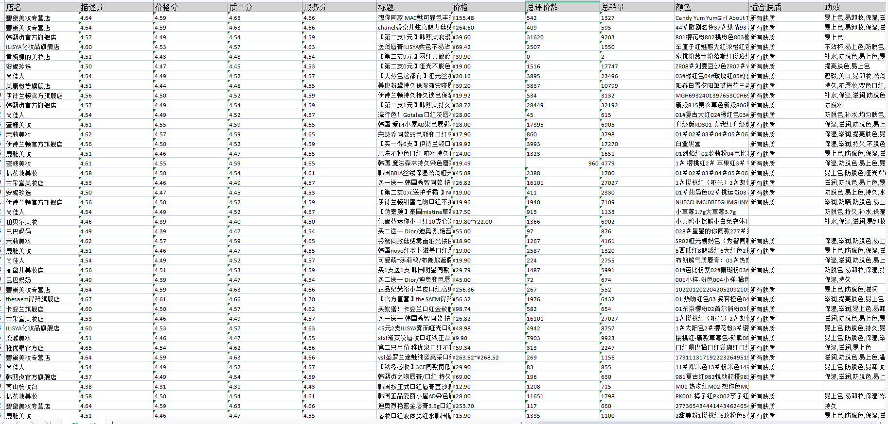                                                                                
<center>图2.1 口红销售数据


## 3.数据预处理

### 3.1数据清洗

​		从图2.1的数据中，可以发现有部分数据，如价格字段，爬取下来的价格字段的数据是一个中文字符类型，且价格是一个价格区间，如￥19.80~￥22.0。这影响了数据的进一步分析。本文对价格数据进行数据清洗，将价格数据中的"￥"字符去掉，然后对部分价格为价格区间的数据取均值。

​		将书转化为字符串，并进行字符分割和字符截取，将价格区间转换为数据类型，然后对价格区间求平均，以价格的平均值来代替价格区间。


<center>图3.1 对价格区间取均值
</center>

​		将价格字段去掉“￥”符号，并转化为数字类型。

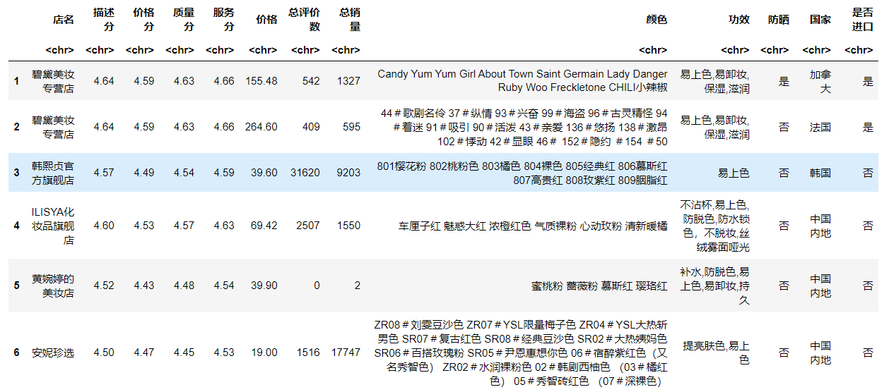

<center>图3.2 数据清洗后价格字段的数据
</center>

​		使用summary方法对数据进行初步的数据分析。

```R
# 查看结构信息
summary(data)
```

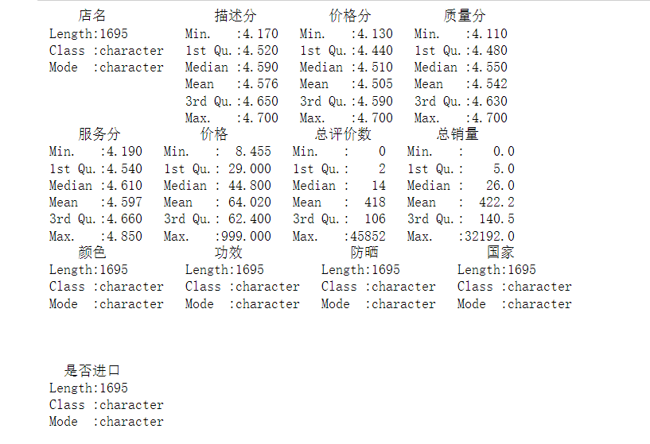

<center>图3.3 数据初步分析结果
</center>

​		从上面的初步的分析报告可得，一共有1695条数据，其中描述分的最小值为4.170，平均值为4.576，最大值为4.7;价格分的最小值为4.13，平均值为4.505，最大值为4.7；质量分的最小值为4.110，平均值为4.542，最大值为4.7；服务分的最小值为4.190，平均值为4.597，最大值为4.85；价格的最小值为8.455，平均值为64.020，最大值为999；总评价数的最小值为0，平均值为418，最大值为45852；总销量的最小值为0，平均值为422，最大值为32192；

### 3.2缺失值处理

​		使用mice库查看数据的缺失情况。

```R
#数据缺失值的处理
library(mice)
#查看文件数据缺失情况
md_data=md.pattern(data)
```

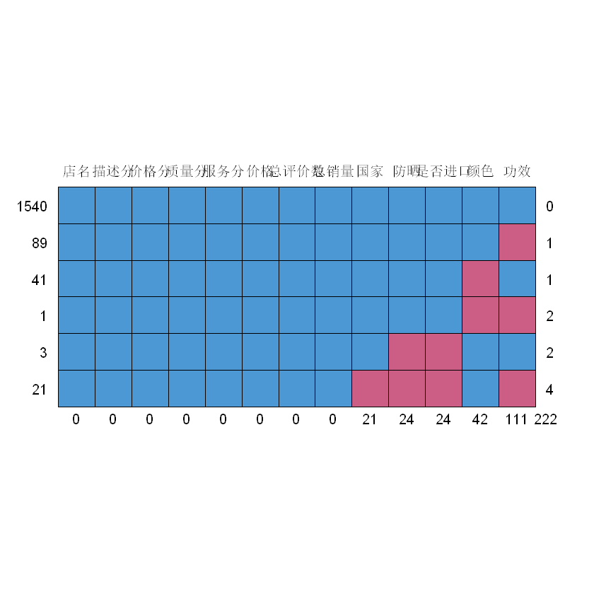

<center>图3.4 数据缺失字段信息
</center>

​		上图中粉红色的代表缺失的数据，蓝色的代表不缺失的数据。可以看出缺失的数据都是非数值的数据。缺失数据的字段为国家、防晒、是否进口、颜色和功效。

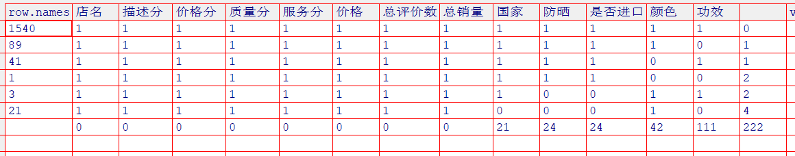

<center>图3.5 数据缺失字段详情
</center>		

​		可以看出，除了店名，其他非数值类型的数据都存在缺失的现象。共缺失数据记录155行，其中，功效字段缺失数据情况最多。

​		由于缺失的数据都是非数值类型的数据，对数值类型的数据没有影响，为方便下文的数据分析，故删除缺失记录的数据以排除缺失值带来的影响。

## 4.简单数据分析

### 4.1词云分析

#### 4.1.1口红颜色词云分析

​		口红的颜色复杂，对口红销售数据的颜色字段进行单纯的数据展示难以具体统计出人们喜欢的颜色具体是哪些。

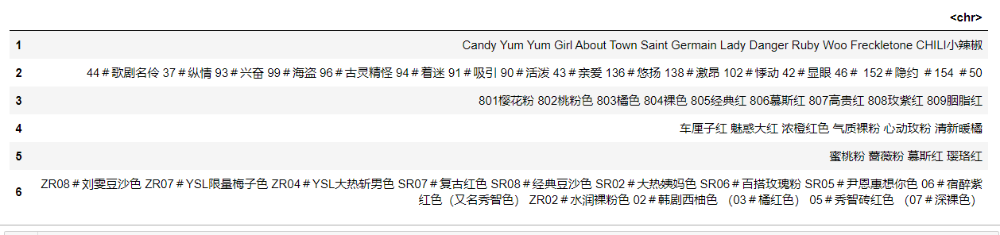

<center>图4.1 部分口红销售数据的颜色数据
</center>

​		使用R语言提供的JiebaR分词库进行中文分词，使用RwordSeg分词、RcolorBrewer库和wordcloud库进行词云的分析。使用('朱红色','粉红色','粉色','玫红','樱桃红','西瓜红','姨妈色','玫紫','经典红','胭脂红','豆沙色','橘子红','哑光', '草莓红','酒红色','玫瑰红','暖橙红','中国红','砖红色','复古红','双色','小样','PBF','M0','80','NO.', 'SE0','RD0','CR0','PK0','OR','PBG','豆沙红','姨妈','复合','CR','水光','MHS',红','RD','CR','1#''2#','3#','4#','5#','6#','7#','8#','9#','10#','11#','12#','13#','14#','15#','#1','#2','#3','#4','#5', '#6','#7','#8','#9','#10','#11','#12','#13','#14','#15','#20','#30','#40','#50','#60','#70','#80','#90','M0'作为分词的字段进行分词，共得到颜色数据3021个。

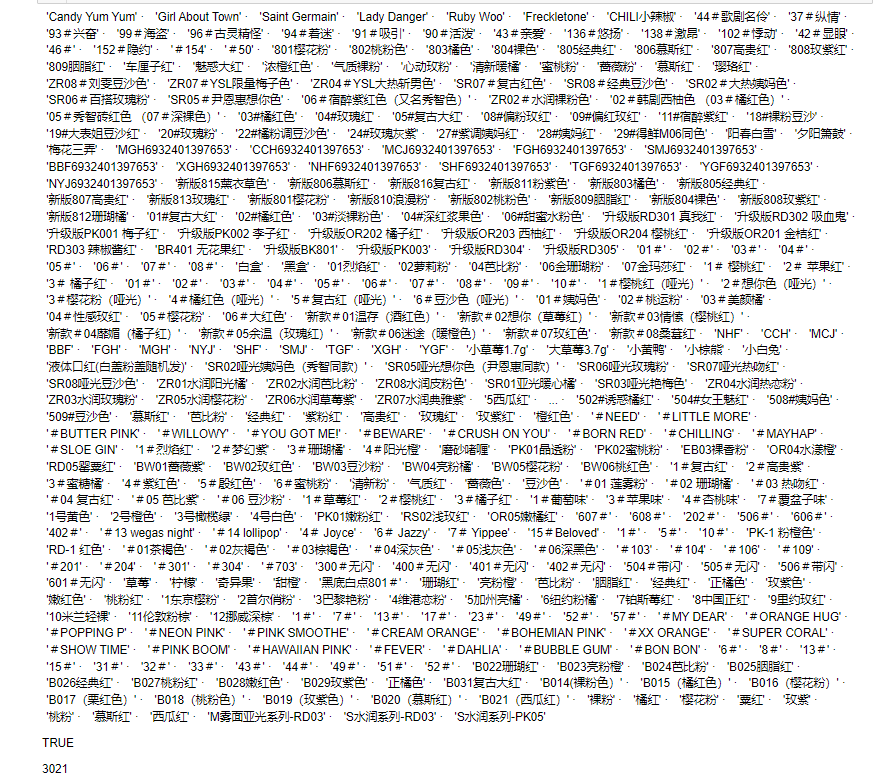

<center>4.2 分词后的颜色数据
</center>

​		对分词后颜色进行词频的统计，统计得到前100个颜色的词频。得到前100个词频的统计结果如下：


<center>4.3 颜色数据的词频统计
</center>

​		制作颜色数据的词云图：

```R
# 制作词云
wordcloud(data_color$seg_color , data_color$Freq, colors = rainbow(100), random.order=F)
```

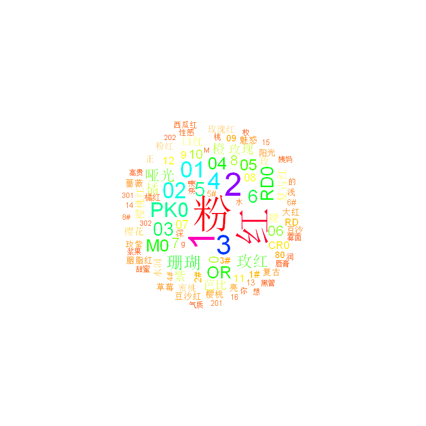

<center>4.4 颜色数据的词云分析图
</center>


#### 4.1.2口红功效词云分析

​		查看口红销售数据中的口红的功效数据，可以看出，口红的功效数据多，而且每个口红的功效含有多个，难以统计出最受欢迎的功效是哪些。

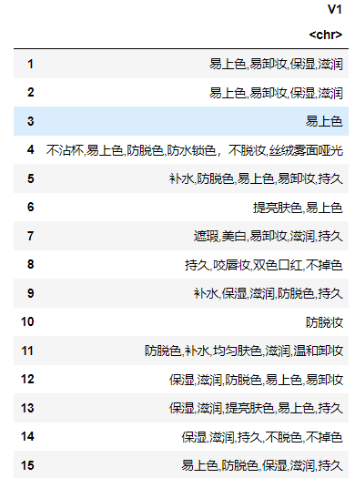

<center>4.5 口红的部分功效数据
</center>

​		使用"易上色","易卸妆","不沾杯","不脱妆","防脱色","非小样唇膏","均匀肤色","防脱妆","不掉色","双色口红","雾面哑光","不脱色","温和卸妆","不粘杯","姨妈色","咬唇妆","提亮肤色","均匀肤色","清爽不油腻", "哑光唇","液体唇蜜","粘杯唇膏","唇部去死皮","哑光豆沙色","其他功效","哑光口红","按钮唇膏","唇颊两用", "豆沙色","植物成份"这些字段对口红的功效字段进行分词。分词后的结果如图4.6所示：

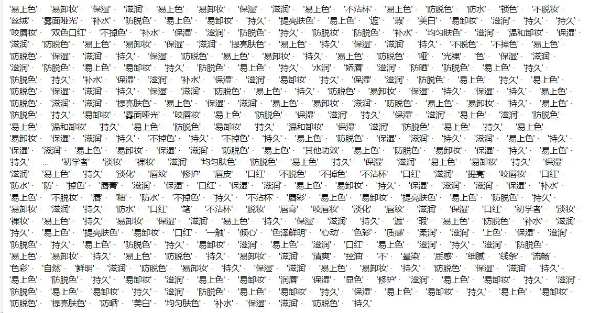

<center>4.6 口红的功效数据分词结果
</center>

​		对分词后的口红功效数据的统计结果进行词频统计，共得到分词结果169个，结果如图4.7所示：

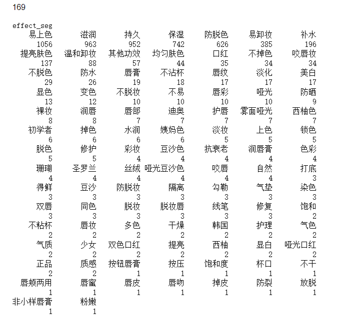

<center>4.7 口红的功效数据词频统计
</center>


​		对口红功效数据进行词云分析，得到词云图如图4.8所示：

```R
data_Effect=data.frame(effect_seg)
# 制作词云
wordcloud(data_Effect$effect_seg , data_Effect$Freq, colors = rainbow(100), random.order=F)
```

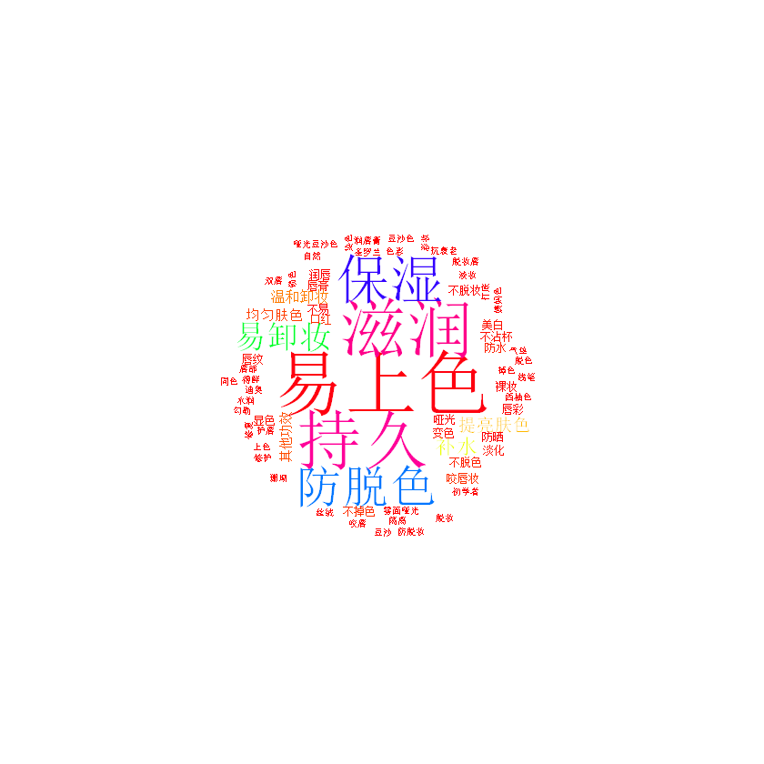

<center>4.8 口红的功效数据词云分析
</center>


### 4.2直方图分析

​		绘制图像的价格的频率直方图，如图4.9所示：

```R
hist(data$价格,xlab="价格", main="价格柱状图",ylab='出现频率',col="red",border='black')
```

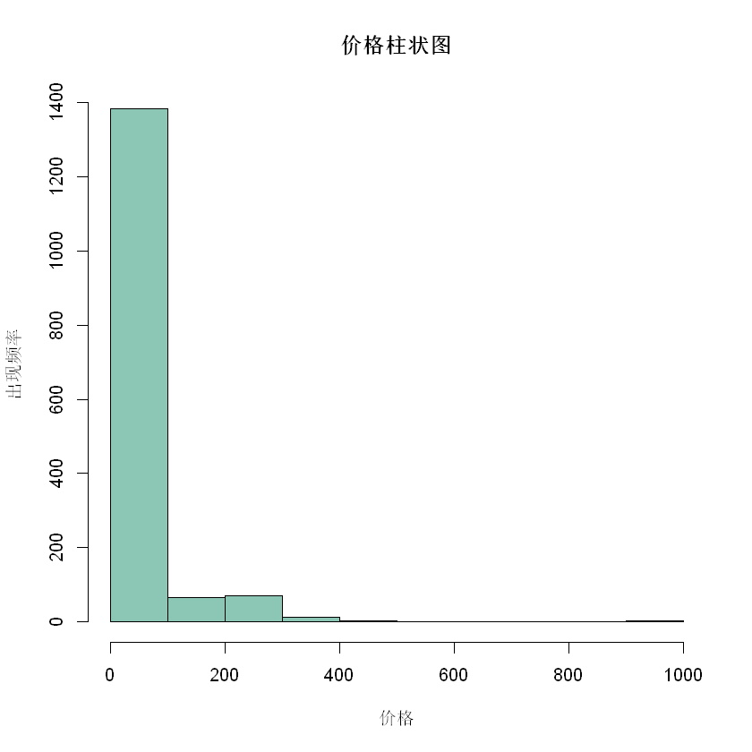

<center>4.9 口红的价格的频率直方图
</center>

​		从上图可以看出，口红的价格的区间主要集中在0-400之间，而100以内的口红占了多数。

对口红的总销量进行分析，绘制了口红总销量的频率直方图，如图4.10所示：

```R
hist(data$总销量,xlab="销量", main="价格柱状图",ylab='出现频率',col="green",border='black')
```

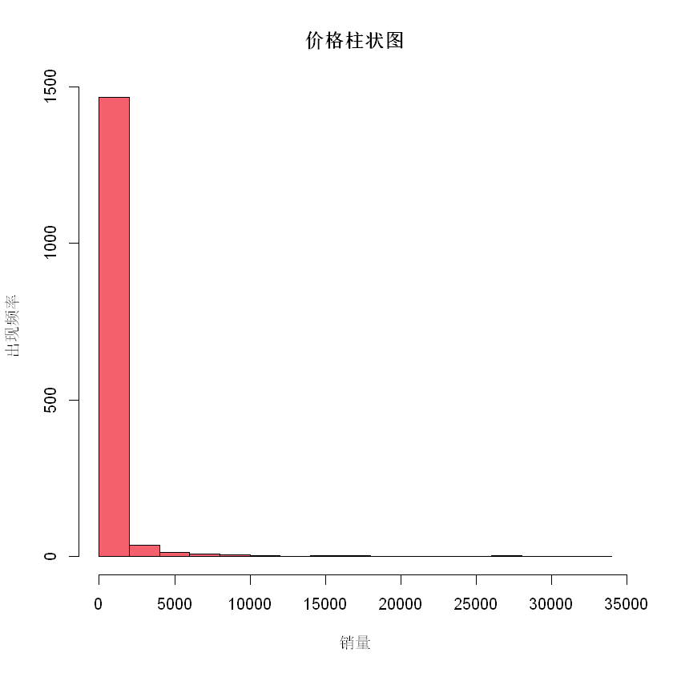

<center>4.10 口红的总销量的频率直方图
</center>

​		对口红的价格分进行分析，绘制口红的价格分的频率直方图如图4.11所示：

```R
hist(data$价格分,xlab="价格分", main="价格分柱状图",ylab='出现频率',col="#19CAAD",border='black')
```

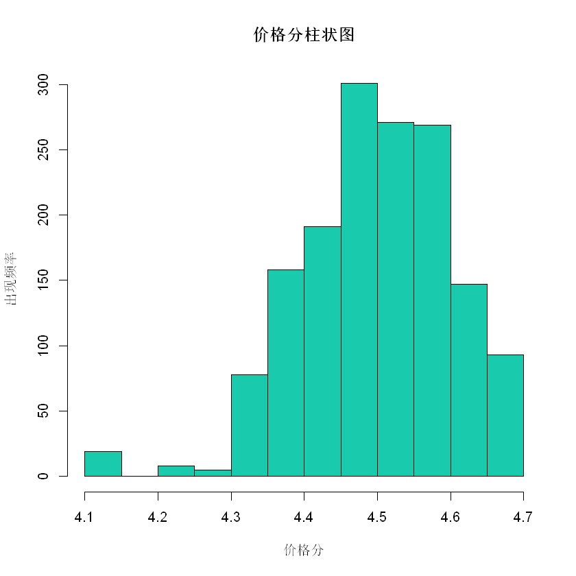

<center>4.11 口红的价格分的频率直方图
</center>

​		可以看出，口红的价格分基本服从一个正态分布，价格分主要集中在4.4，4.5，4.6。

​		对口红的服务分进行分析，绘制口红的服务分的频率直方图如图4.12所示：

```R
hist(data$服务分,xlab="服务分", main="服务分柱状图",ylab='出现频率',col="#ECAD9E",border='black')
```

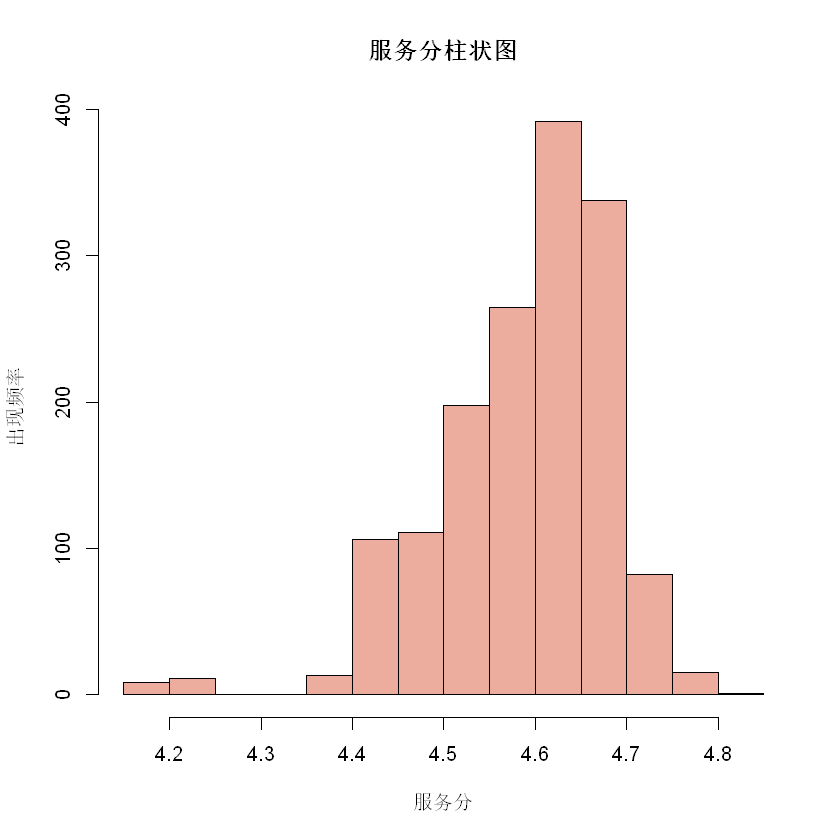

<center>4.12 口红的服务分的频率直方图
</center>

​		可以看出，口红的服务分主要集中在4.5，4.6，4.7之间。

​		对口红的描述分进行分析，绘制口红的描述分的频率直方图如图4.13所示：

```R
hist(data$描述分,xlab="描述分", main="描述分分柱状图",ylab='出现频率',col="#BEEDC7",border='black')
```

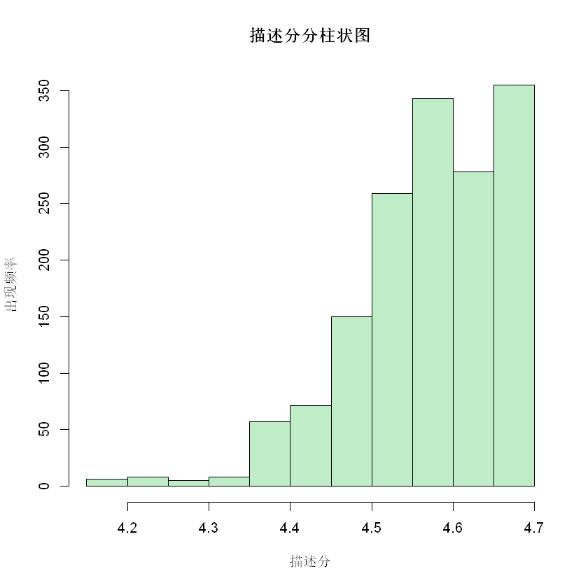

<center>4.13 口红的描述分的频率直方图
</center>

​		可以看出，大多数店铺的描述分都在4.4及以上，能够较好的描述自己的产品。

​		对口红的质量分进行分析，绘制口红的质量分的频率直方图如图4.14所示：

```R
hist(data$质量分,xlab="质量分", main="质量分分柱状图",ylab='出现频率',col="#A0EEE1",border='black')
```

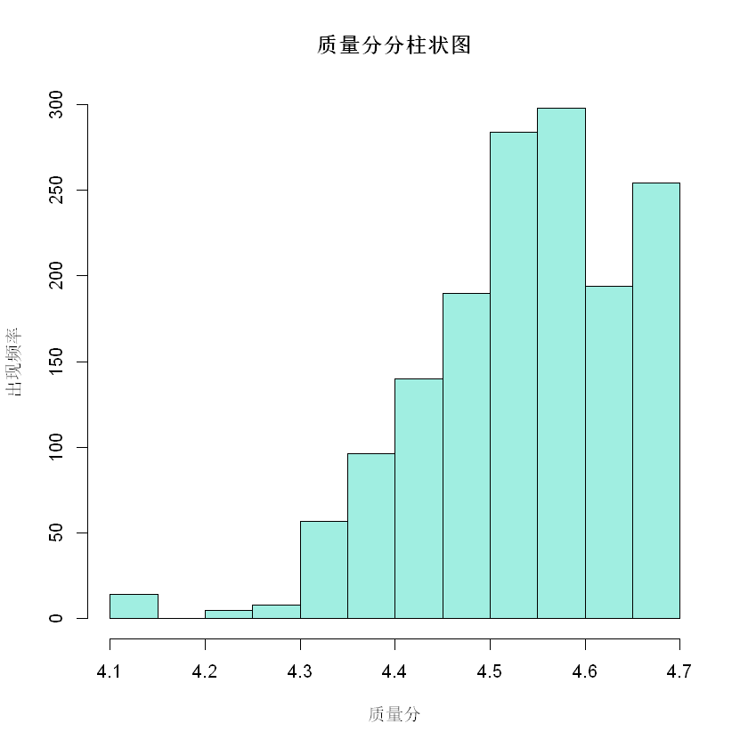

<center>4.14 口红的质量分的频率直方图
</center>

​		对口红的总评价数进行分析，绘制口红的总评价数的频率直方图如图4.15所示：

```R
hist(data$质量分,xlab="质量分", main="质量分分柱状图",ylab='出现频率',col="#A0EEE1",border='black')
```

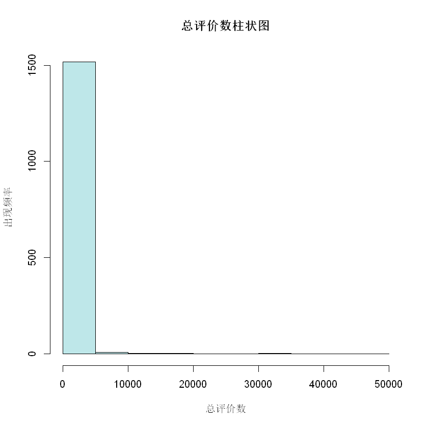

<center>4.15 口红的总评价数的频率直方图
</center>

### 4.3箱线图和散点图分析

​		对所有商品的描述分、价格分、质量分、服务分的进行分析，绘制商品的描述分、价格分、质量分、服务分的箱线图如图4.16所示：

```R
boxplot(data[,c(2,3,4,5)],col=2:5)
#所有商品的描述分、价格分、质量分、服务分的箱线图
```

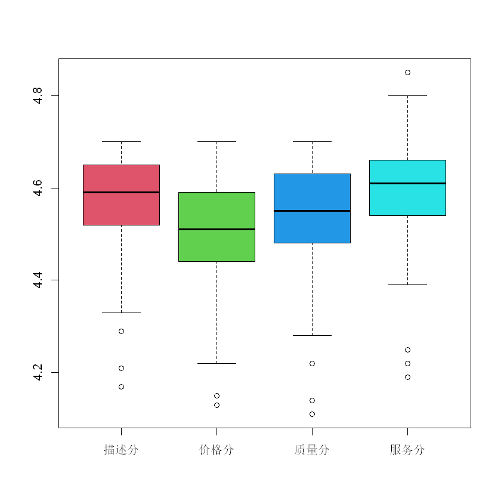

<center>4.16 口红的描述分、价格分、质量分、服务分的箱线图
</center>

​		可以看出，口红的服务分和描述分的均值要远远高于价格分和质量分的均值，服务分有利于让顾客成为回头客，而描述分可以使得顾客去购买这件口红。

​		为了探索总评价数和总销量的关系，绘制了总评价数和总销量之间的散点图。

```R
##探索价格和总销量的关系
data<-data.frame(data)
ggplot(data, aes(x=价格, y=总销量)) +geom_point(aes(colour=是否进口))
```

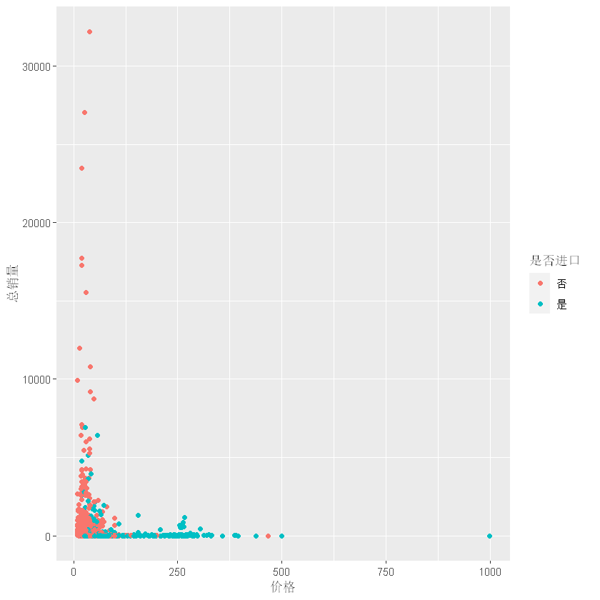

<center>4.17 口红的价格和总销量的散点图
</center>

​		图4.17中，橙色的点代表不是进口的，绿色的点代表进口的。可以得出，一般来说进口的口红的价格要远远高于不是进口的口红的价格。非进口的口红的销量要远远高于进口口红的销量。

​		为了探索价格和总销量的关系，绘制了价格和总销量之间的散点图。

```R
##探索总评价数和总销量的关系
data<-data.frame(data)
ggplot(data, aes(x=总评价数, y=总销量)) +geom_point(aes(colour=是否进口))
```

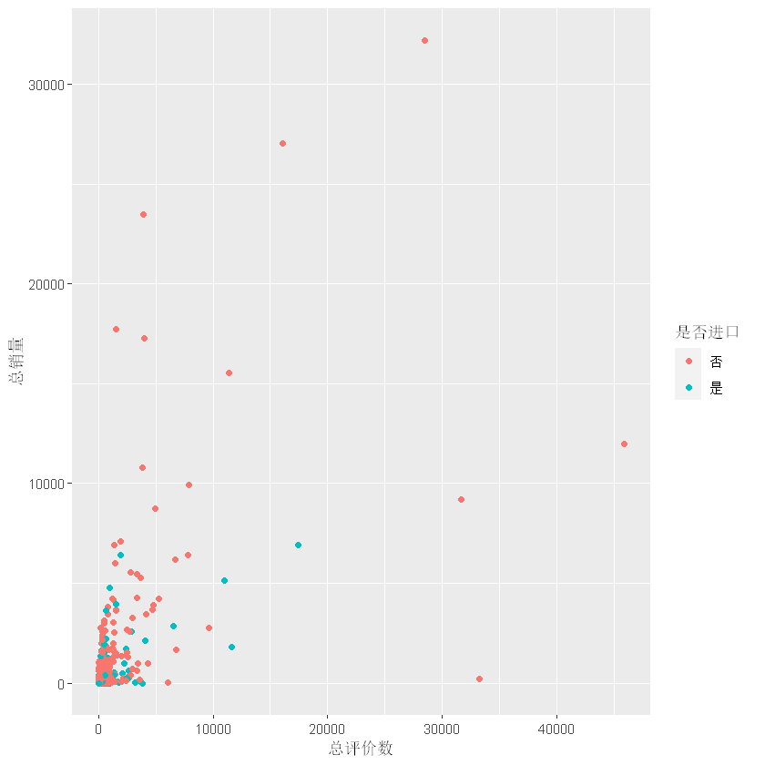

<center>4.18 口红的总评价数和总销量的散点图
</center>

​		为了探索描述分和总销量的关系，绘制了描述分和总销量之间的散点图。

```R
##探索描述分和总销量的关系
ggplot(data, aes(x=描述分, y=总销量)) +geom_point(aes(colour=是否进口))
```

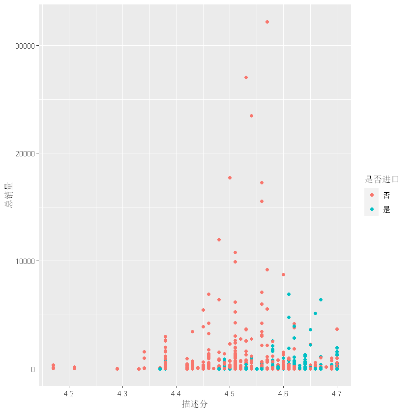

<center>4.19 口红的描述分和总销量的散点图
</center>

​		可以看出，一般来说，进口口红的描述分要高于非进口口红的描述分。可能受到价格的影响，部分非进口的销量要远高于进口口红的销量。

​		为了探索价格分和总销量的关系，绘制了价格分和总销量之间的散点图。

```R
##探索价格分和总销量的关系
ggplot(data, aes(x=价格分, y=总销量)) +geom_point(aes(colour=是否进口))
```

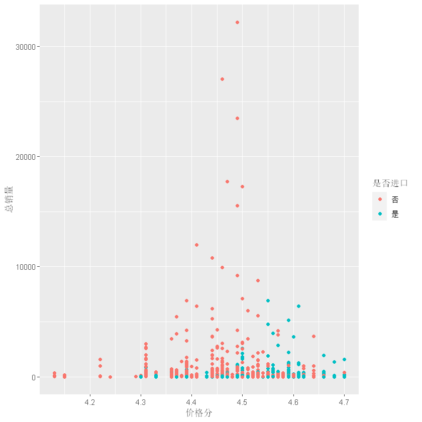

<center>4.20 口红的价格分和总销量的散点图
</center>

​		可以看出，一般来说，进口的口红价格分要高于非进口口红的价格分，进口口红的销量一般要低于非进口口红的销量。

​		为了探索质量分和总销量的关系，绘制了质量分和总销量之间的散点图。

```R
##探索质量分和总销量的关系
ggplot(data, aes(x=质量分, y=总销量)) +geom_point(aes(colour=是否进口))
```

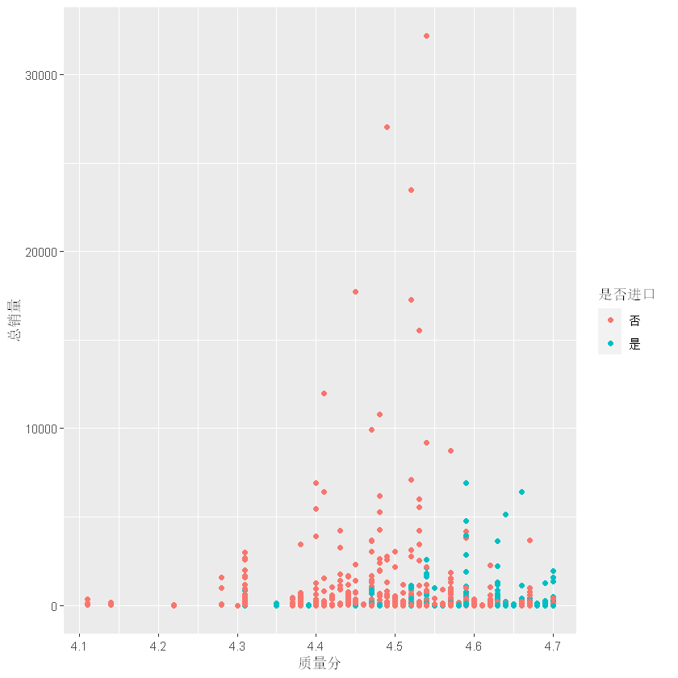

<center>4.21 口红的质量分和总销量的散点图
</center>

​		可以看出，一般来说，国产的口红占据中端和低端市场。进口的口红占据了高端的市场。

​		为了探索服务分和总销量的关系，绘制了服务分和总销量之间的散点图。

```R
##探索服务分和总销量的关系
ggplot(data, aes(x=服务分, y=总销量)) +geom_point(aes(colour=是否进口))
```

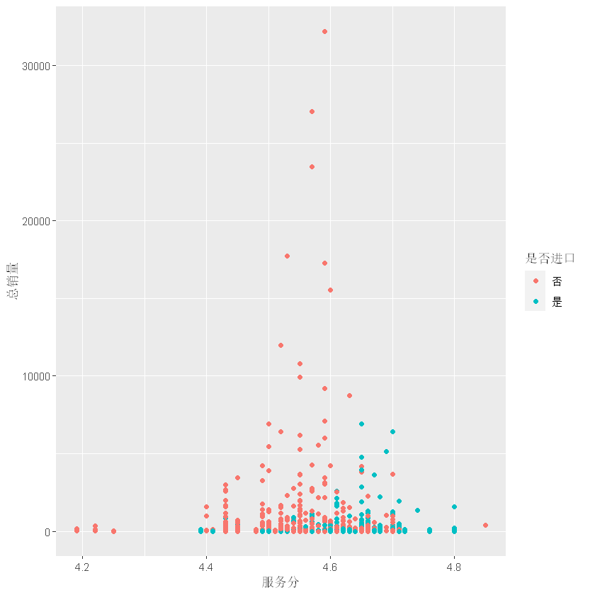

<center>4.22 口红的服务分和总销量的散点图
</center>

​		可以看出，一般来说，进口口红的服务分要高于国产口红的服务分，也侧面说明进口口红的服务要优于国产口红。

## 5.深度数据分析

### 5.1数据抽样处理

#### 5.1.1销量数据分级处理

​		绘制总销售量的直方图可以看出，总销售量是一个不均匀的分布。

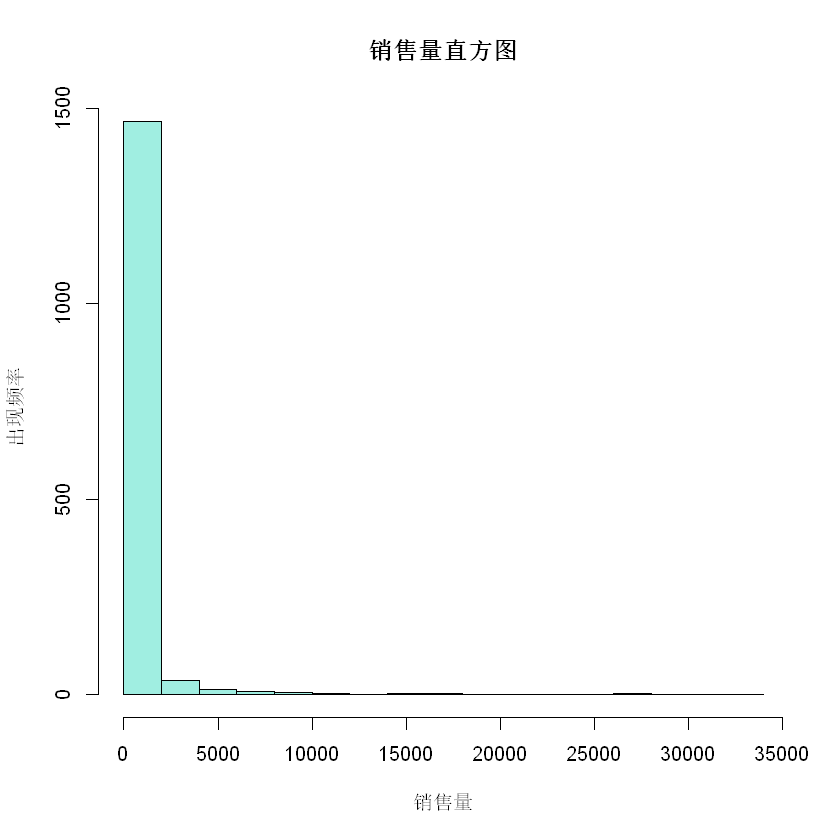

<center>5.1 口红的总销量的分布直方图
</center>

​		为了方便后续进行深度的数据分析，将口红的销量分成A、B、C三个等级来代表口红总销量的高、中、低三个层次。

​		划分后三个等级的店铺的数量分别为**A:467、B:566、C:507**

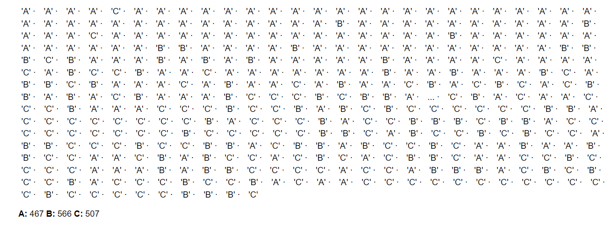

<center>5.2 口红的总销量等级划分
</center>

#### 5.1.2口红功效权值处理

​		为了方便后续的分析，对功效字段进行分词处理，并按照功效的重要性，进行满分5分的权值计算，得到如下权值表。

<center>5.1 口红的功效权值表
</center>

| 易上色 | 滋润 | 持久 | 保湿 | 防脱色 | 易卸妆 |  补水  | 温和卸妆 | 均匀肤色 |
| :----: | :--: | :--: | :--: | :----: | :----: | :----: | :------: | :------: |
|   4    |  5   |  4   |  5   |   4    |   4    |   5    |    5     |    4     |
| 不掉色 | 防水 | 水润 | 哑光 | 不粘杯 | 咬唇妆 | 不脱色 | 提亮肤色 | 其他功能 |
|   3    |  4   |  5   |  2   |   3    |   4    |   3    |    5     |    1     |

​		每个口红的功效越多，最后对应的权值也就越大，如此便将字符类型的口红功效转化为数值类型的功效，便于后期分析。

#### 5.1.3数据归一化处理

​		描述分、价格分、质量分、服务分是采用五分制，而和价格、销量等字段之间的大小的差异性也比较大，故采用最大最小值的方法对数据进行归一化处理。

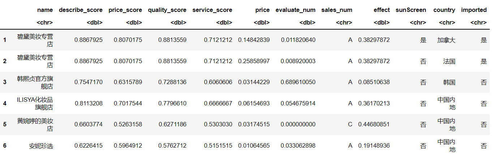

<center>5.3 归一化后的数据
</center>

​		归一化ABC数据的比例为：117：142：127.

​		通过分层抽样，对数据集进行划分，划分为训练集和测试集。其中训练集的个数为1154，测试集的个数为386.

### 5.2朴素贝叶斯判别分析

#### 5.2.1朴素贝叶斯算法原理

​		贝叶斯的思想可以概括为先验概率+数据=后验概率。就是在实际问题中，后验概率可以通过先验概率和数据一起综合得到的，但是先验概率的一般是无法得到的，通常是假设为正态分布或者beta分布。

在介绍朴素贝叶斯的原理之前，先介绍条件独立公式，如果X和Y相互独立，那么：
$$
P(X, Y)=P(X) P(Y)
$$
​		条件概率公式为：
$$
P(Y \mid X)=P(X \mid Y) P(Y) / P(X)
$$
​		全概率公式为：
$$
P(X)=\sum_{k} P\left(X \mid Y=Y_{k}\right) P\left(Y_{k}\right) \text { 其中 } \sum_{k} P\left(Y_{k}\right)=1
$$
​		进而得到贝叶斯公式为：
$$
P\left(Y_{k} \mid X\right)=\frac{P\left(X \mid Y_{k}\right) P\left(Y_{k}\right)}{\sum_{k} P\left(X \mid Y=Y_{k}\right) P\left(Y_{k}\right)}
$$
​		假设我们的分类模型的样本是：
$$
\left(x_{1}^{(1)}, x_{2}^{(1)}, \ldots x_{n}^{(1)}, y_{1}\right),\left(x_{1}^{(2)}, x_{2}^{(2)}, \ldots x_{n}^{(2)}, y_{2}\right), \ldots\left(x_{1}^{(m)}, x_{2}^{(m)}, \ldots x_{n}^{(m)}, y_{m}\right)
$$
​		即我们有m个样本，每个样本有n个特征，特征输出K个类别。

从样本中我们可以学习得到朴素贝叶斯的先验分布：
$$
P\left(Y=C_{k}\right)(k=1,2, \ldots K)
$$
​		然后接着可以学习到条件概率分布：
$$
P\left(X=x \mid Y=C_{k}\right)=P\left(X_{1}=x_{1}, X_{2}=x_{2}, \ldots X_{n}=x_{n} \mid Y=C_{k}\right)
$$
​		然后利用贝叶斯公式得到X和Y的联合分布P(X,Y)了，得到联合分布如下：
$$
\begin{aligned}
P\left(X, Y=C_{k}\right) &=P\left(Y=C_{k}\right) P\left(X=x \mid Y=C_{k}\right) \\
&=P\left(Y=C_{k}\right) P\left(X_{1}=x_{1}, X_{2}=x_{2}, \ldots X_{n}=x_{n} \mid Y=C_{k}\right)
\end{aligned}
$$
​		但是$$
P\left(X_{1}=x_{1}, X_{2}=x_{2}, \ldots X_{n}=x_{n} \mid Y=C_{k}\right)
$$是难以求得的。

​		朴素贝叶斯对X进行了假设，假设X的n个维度之间相互独立。

则求得：
$$
P\left(X_{1}=x_{1}, X_{2}=x_{2}, \ldots X_{n}=x_{n} \mid Y=C_{k}\right)=P\left(X_{1}=x_{1} \mid Y=C_{k}\right) P\left(X_{2}=x_{2} \mid Y=C_{k}\right) \ldots P\left(X_{n}=x_{n} \mid Y=C_{k}\right)
$$
​		当给定新的样本特征$$\left(x_{1}^{(t e s t)}, x_{2}^{(t e s t)}, \ldots x_{n}^{(t e s t)}\right.$$使用后验概率最大化来进行分类，计算出所有的K个条件概率$$P\left(Y=C_{k} \mid X=X^{(\text {test })}\right)$$,然后找出最大的条件概率对应的类别，就完成了朴素贝叶斯的预测。

#### 5.2.2算法实现

​		通过调用R的e1071库和klaR库中的NaiveBayes方法，生成朴素贝叶斯的判别规则，然后绘制关于是否防晒、是否进口、价格的密度图，计算朴素贝叶斯的预测的混淆矩阵，核心代码如下：

```R
library(klaR)
library(e1071)
# 模型训练
# 对样本进行预处理，去掉 店名name 
data<-data[Train_data_num,-1]
# 生成判别规则
data_Bayes<-NaiveBayes(as.factor(sales_num)~.,data)
# 对是否防晒各类别绘制密度图
plot(data_Bayes,vars="describe_score",main="describe_score--密度图",n=20,lwd = 2,col=c("DeepPink","#D55E00","DarkTurquoise","#0033FF","#000000","#009900")) 
# 对价格各类别绘制密度图
plot(data_Bayes,vars = "price",main="price--密度图",n=50,lwd = 2,col = c("DeepPink","#D55E00","DarkTurquoise","#0033FF","#000000","#009900")) 
# 对是否进口各类别绘制密度图
plot(data_Bayes,vars = "imported",main="imported--密度图",n=50,col = c("DeepPink","#D55E00","RDarkTurquoise","#0033FF","#000000","#009900")) 
# 计算贝叶斯判别预测错误概率
error_Bayes<-sum(as.numeric(as.numeric(pred_Bayes$class)
                            !=as.numeric(data7$sales_num)))/nrow(data)
```

#### 5.2.3分析结果

​		通过函数NaiveBayes生成判别规则，绘制了描述分和价格的密度图。

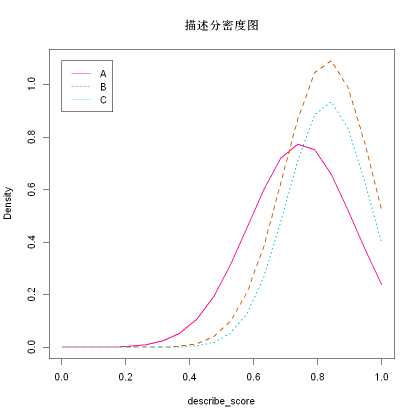

<center>5.4 描述分密度图
</center>

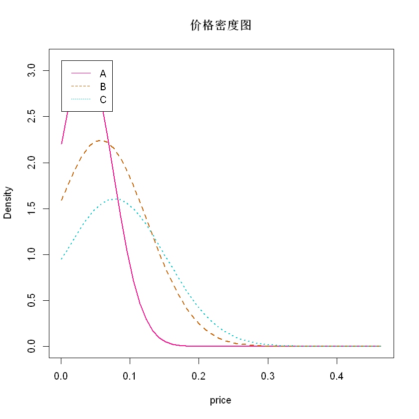

<center>5.5 价格密度图
</center>

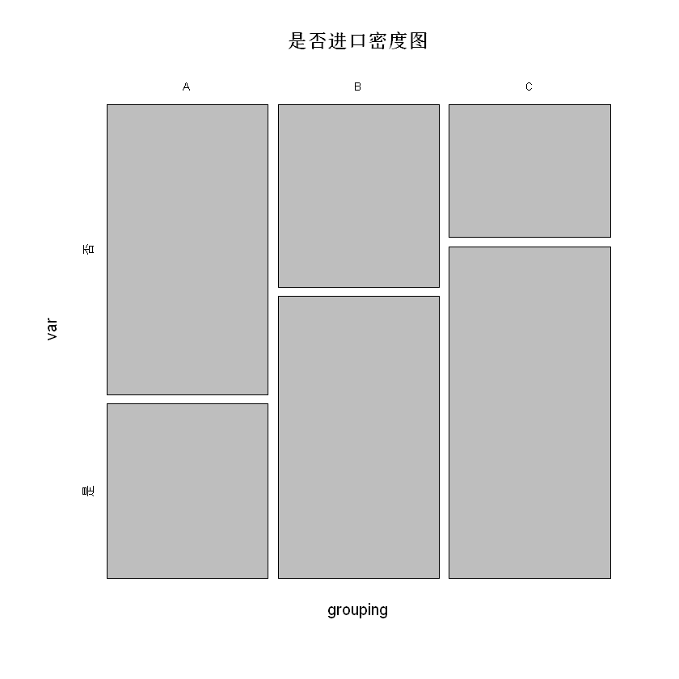

<center>5.6 是否进口密度图
</center>

​		从上图可以得知，在描述分密度图中，销售总量类型 B 和 C 主要集中在 0.82左右，而类型 A 主要集中在 0.73 左右；在字段价格分密度图中，类型 A 的数量比其他 2 个类型都要小。

​		使用朴素贝叶斯的方法对变量进行预测，预测的错误率在51.32%左右，具有较高的错误率。

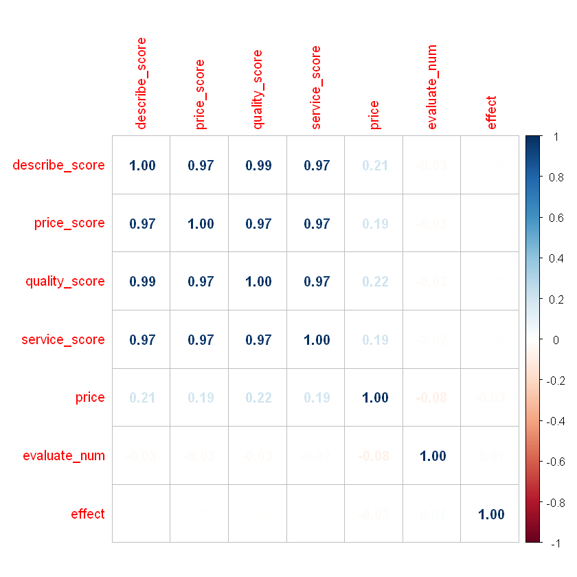

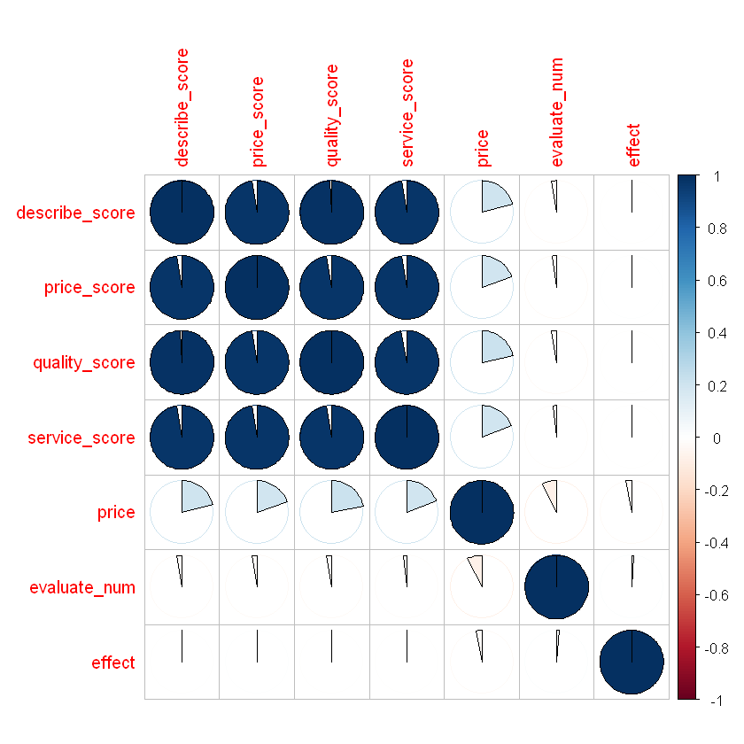

<center>5.7 变量相关性图
</center>

​		通过图5.7可得，价格分和描述分之间的相关性为0.97，质量分和描述分之间的相关性为0.99，服务分和描述分的相关性为0.97，价格和描述分之间的相关性为0.21.由此图可以得知，各个字段之间的相关性较高，不符合朴素贝叶斯各个变量之间独立的条件，故无法用朴素贝叶斯完成预测任务。

### 5.3AdaBoost算法

#### 5.3.1AdaBoost算法原理

​		在介绍AdaBoost原理之前，先介绍一下Boosting算法的基本思想。


<center>5.8 Boosting算法的基本思想
</center>

​		Boosting算法的工作机制是首先从训练集用一个初始权重训练出一个弱学习器1，根据弱学习器的学习误差率表现来更新训练样本的权重，使得之前的弱学习器1学习误差率高的训练样本点的权重变高，使得这些误差率高的点在后面的弱学习器2中得到更多的重视，然后基于调整权重后的训练集来训练弱学习器2。直到弱学习器到达事先指定的数目T,最终将这T个弱学习器通过集合策略来进行整合，得到最终的强学习器。

​		Adaboost算法的基本思想：

​		假设训练集样本是：
$$
T=\left\{\left(x, y_{1}\right),\left(x_{2}, y_{2}\right), \ldots\left(x_{m}, y_{m}\right)\right\}
$$
​		1)训练集的在第K个弱学习器的输出权重为：
$$
D(k)=\left(w_{k 1}, w_{k 2}, \ldots w_{k m}\right) ; w_{1 i}=\frac{1}{m} ; \quad i=1,2 \ldots m
$$
​		2)对于k=1,2，...K:

​				a) 使用具有权重 $D_{k}$ 的样本集来训练数据，得到弱分类器 $G_{k}(x)$
​				b)计算 $G_{k}(x)$ 的分类误差率
$$
e_{k}=P\left(G_{k}\left(x_{i}\right) \neq y_{i}\right)=\sum_{i=1}^{m} w_{k i} I\left(G_{k}\left(x_{i}\right) \neq y_{i}\right)
$$
​				c)计算弱分类器的系数为：
$$
\alpha_{k}=\frac{1}{2} \log \frac{1-e_{k}}{e_{k}}
$$
​				d) 更新样本集的权重分布:
$$
w_{k+1, i}=\frac{w_{k i}}{Z_{K}} \exp \left(-\alpha_{k} y_{i} G_{k}\left(x_{i}\right)\right) \quad i=1,2, \ldots m
$$
​				这里 $Z_{k}$ 是规范化因子
$$
Z_{k}=\sum_{i=1}^{m} w_{k i} \exp \left(-\alpha_{k} y_{i} G_{k}\left(x_{i}\right)\right)
$$
　 3) 构建最终分类器为：
$$
f(x)=\operatorname{sign}\left(\sum_{k=1}^{K} \alpha_{k} G_{k}(x)\right)
$$
​		对于Adaboost多元分类算法，其实原理和二元分类类似，最主要区别在弱分类器的系数上。比如Adaboost SAMME算法，它的弱分类器的系数:
$$
\alpha_{k}=\frac{1}{2} \log \frac{1-e_{k}}{e_{k}}+\log (R-1)
$$
​		其中R为类别数。从上式可以看出，如果是二元分类，R=2，则上式和我们的二元分类算法中的弱分类器的系数一致。

#### 5.3.2算法实现

​		使用R语言提供的adabag包rpart来构建Adaboost算法模型。核心代码如下：

```R
data<-data[Train_data_num,-1]
# data4 <- subset(data4,as.numeric(data4$country) != 3)
# head(data4)
# 模型构建
data <- data[,-10]
data$sales_num <- as.factor(data$sales_num)
boost=boosting(sales_num~.,data,boos = TRUE,mfinal = 500)
```

#### 5.3.3分析结果

​		通过函数boosting来构建Adaboost模型，基分类器的个数为500。使用boost$trees查看树的组成为：

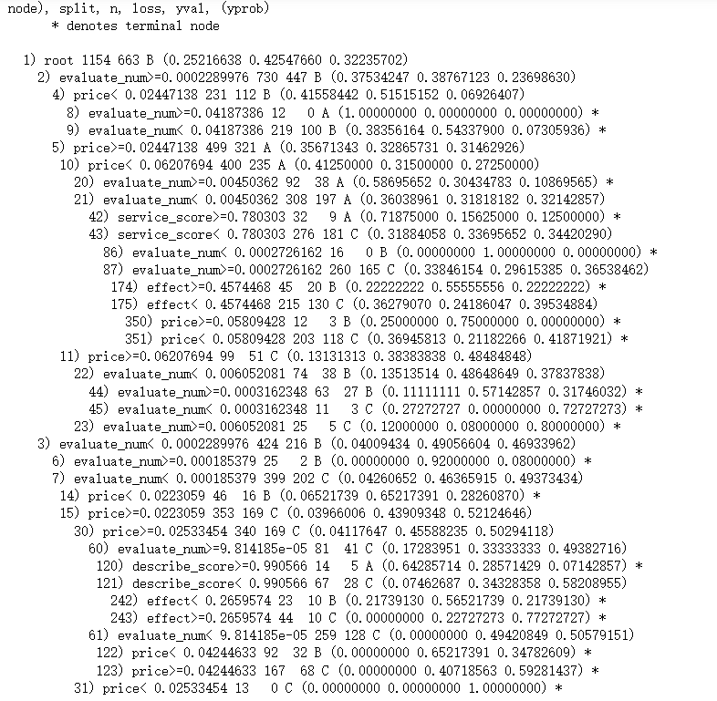

<center>5.9 Boosting算法的树结构
</center>

​		通过Adaboost模型得到各个变量之间的相对重要性为：


<center>5.10 各个变量之间的相对重要性
</center>

**evaluate_num：67.6372262771787  price：13.8492633972519**

**price_score：5.58837149110566  describe_score：5.58007438564345**

**quality_score：3.41355592885641  service_score:2.92033406709359**

**sunScreen:0.642266647565882  imported:0.32574620091658  effect:0.0431616043878492**

​		使用AdaBoost算法预测的混淆矩阵为：

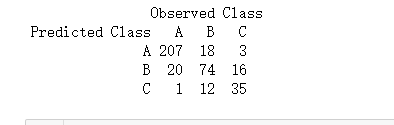

<center>5.11 AdaBoost算法预测的混淆矩阵
</center>

​		使用AdaBoost算法预测的错误率为：0.181347150259067

### 5.4随机森林算法

#### 5.4.1随机森林算法原理

​		在介绍随机森林算法之前，先介绍Bagging算法的原理：


<center>5.12 Bagging算法的原理图
</center>

​		Bagging的弱学习器之间没有像boosting那样的联系。bagging的特点在于随机采样。随机采样(bootsrap)就是从我们的训练集里面采集固定个数的样本，但是每采集一个样本后，都将样本放回。也就是说，之前采集到的样本在放回后有可能继续被采集到。对于我们的Bagging算法，一般会随机采集和训练集样本数m一样个数的样本。这样得到的采样集和训练集样本的个数相同，但是样本内容不同。如果我们对有m个样本训练集做T次的随机采样，则由于随机性，T个采样集各不相同。

​		Bagging算法流程如下：

​		输入为样本集 $D=\left\{\left(x, y_{1}\right),\left(x_{2}, y_{2}\right), \ldots\left(x_{m}, y_{m}\right)\right\}$ ，弱学习器算法，弱分类器迭代次数 $\mathrm{T}$ 。

​		输出为最终的强分类器 $f(x)$

​		1）对于t=1,2...,T:

​			a)对训练集进行第t次随机采样，共采集m次，得到包含m个样本的采样集 $D_{t}$
​			b)用采样集 $D_{t}$ 训练第 $\mathrm{t}$ 个弱学习器 $G_{t}(x)$

​		2) 如果是分类算法预测，则T个弱学习器投出最多票数的类别或者类别之一为最终类别。如果是回归算法，T个弱学习器得到的回归结果进行算术平均得到的值为最终的模型输出。

​		随机森林算法是Bagging算法的进化版。首先，RF使用了CART决策树作为弱学习器，这让我们想到了梯度提升树GBDT。第二，在使用决策树的基础上，RF对决策树的建立做了改进，对于普通的决策树，我们会在节点上所有的n个样本特征中选择一个最优的特征来做决策树的左右子树划分，但是RF通过随机选择节点上的一部分样本特征，这个数字小于n。假设为 $n_{s u b}$ ，然后在这些随机选择的 $n_{s u b}$ 个样本特征中，选择一个最优的特征来做决策树的左右子树划分。这样进一步增强了模型的泛化能力。如果 $n_{s u b}=n$ ，则此时RF的CART决策树和普通的CART决策树没有区别。 $n_{s u b}$ 越小，则模型约健壮，当然此时对于训练集的拟合程度会变差。也就是 说 $n_{s u b}$ 越小，模型的方差会减小，但是偏倚会增大。在实际案例中，一般会通过交叉验证调参获取一个合适的 $n_{s u b b}$ 的值。
​		除了上面两点，RF和普通的bagging算法没有什么不同，下面简单总结下RF的算法。输入为样本集 $D=\left\{\left(x, y_{1}\right),\left(x_{2}, y_{2}\right), \ldots\left(x_{m}, y_{m}\right)\right\}$ ，弱分类器迭代次数 。输出为最㫡的强分类器 $f(x)$。

​		1）对于t=1,2...,T:

​				a)对训练集进行第t次随机采样，共采集m次，得到包含m个样本的采样集 $D_{t}$

​				b)用采样集 $D_{t}$ 训练第 $\mathrm{t}$ 个决策树模型 $G_{t}(x)$ ，在训练决策树模型的节点的时候，在节点上所有的样本特征中选择一部分样本特征， 在这些随机选择的部分样本特征中选择一个最优的特征来做决策树的左右子树划分。

​		2) 如果是分类算法预测，则T个弱学习器投出最多票数的类别或者类别之一为最终类别。如果是回归算法，T个弱学习器得到的回归结果进行算术平均得到的值为最终的模型输出。

#### 5.4.2算法实现

​		使用R语言提供的randomForest来构建随机森林的判别模型，决策树的数量为500。

```R
data$sales_num <- as.factor(data$sales_num)
# data.rf=randomForest(sales_num~.-name-country-sunScreen-imported,data=data,ntree=500,
#                      importance=TRUE,proximity=TRUE,subset=Train_data_num)
data.rf=randomForest(sales_num~.-name,data=data,ntree=500,
                     importance=TRUE,proximity=TRUE,subset=Train_data_num)
# 展示所构建的随机森林模型
print(data.rf)
```

#### 5.4.3分析结果

​		展示构建的随机森林模型：

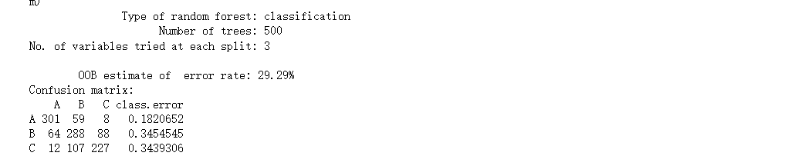

<center>5.13 随机森林的混淆矩阵
</center>

​		得到随机森林的OOB的错误率为29.29%。

​		调用函数 importance(data.rf)查看随机森林模型中变量的重要值为：

<center>5.2 随机森林算法的变量重要性
</center>

| evaluate_num  |   price   | describe_score | price_score | quality_score |
| :-----------: | :-------: | :------------: | :---------: | :-----------: |
|  141.770834   | 43.562885 |   33.589480    |  34.389051  |   33.906606   |
| service_score |  effect   |    country     |  imported   |   sunScreen   |
|   28.820316   | 18.190583 |   15.145921    |  8.015321   |   -1.442242   |

​		调用varlmPlot函数绘制变量重要性曲线，随机森林模型中两种测算方式下自变量重要对比结果如图所示：


<center>5.14 随机森林的变量重要性曲线
</center>

#### 5.4.4模型的优化

​		随机森林的优化方案主要有两点，一个决策树的数量，另一个是决策树节点的变量的个数。

通过参数mtry来改变节点变量的个数，变量的个数为从1到10。得到的误判率如下表所示：

<center>5.3 不同节点数量的误判率
</center>

|         1         |         2         |         3         |         4         |         5         |
| :---------------: | :---------------: | :---------------: | :---------------: | :---------------: |
| 0.350772071975185 | 0.290347712449742 | 0.291736766542283 | 0.282522394028359 | 0.286566053798146 |
|         6         |         7         |         8         |         9         |        10         |
| 0.288912445417569 | 0.288730698849913 | 0.288730698849913 | 0.315683212859912 | 0.316034597979127 |

​		当决策树的节点数为4时，具有最低的模型误判率为  0.282522394028359 。

​		当确定了决策树的节点数时，绘制不同数量的决策树的图如下：

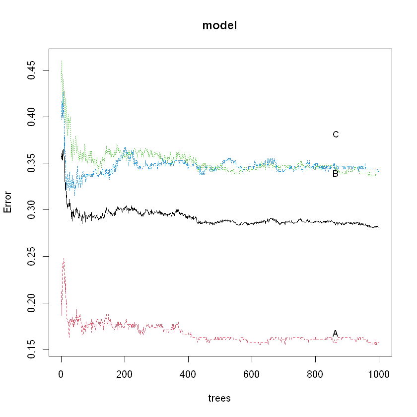

<center>5.15 随机森林的不同数量的决策树的错误图
</center>

​		如图可知，当决策树的数量为600时，模型开始平稳。

​		在经过上述分析以后，本实验确定最优模型为决策树节点处变量个数为 4，模型中决策树数量为 600 的模型。再次进行建模，模型基于 OOB 数据的总体误判率为 29.9%；

​		使用该模型进行预测，预测的错误率为0.0958549222797927。

## 6.主要结论

​		本文对口红的销售数据进行数据清洗、缺失值处理和数据归一化处理等方法对数据进行了预处理，然后使用直方图、箱线图、散点图、词云图对销售数据进行简单的数据分析，使用朴素贝叶斯判别分析、AdaBoost算法和随机森林算法对口红的销量数据进行详细分析和预测。其中，朴素贝叶斯判别分析的预测的错误率在51.32%左右，AdaBoost算法预测的错误率为：18.13%，随机森林的预测的错误率为9.58%。分析结果表明，口红的总评价数、口红价格和口红的描述分这三个因素对口红的销量影响最大。

## 7.参考文献

[1] https://www.cnblogs.com/pinard/p/6156009.html

[2] https://www.cnblogs.com/pinard/p/6131423.html